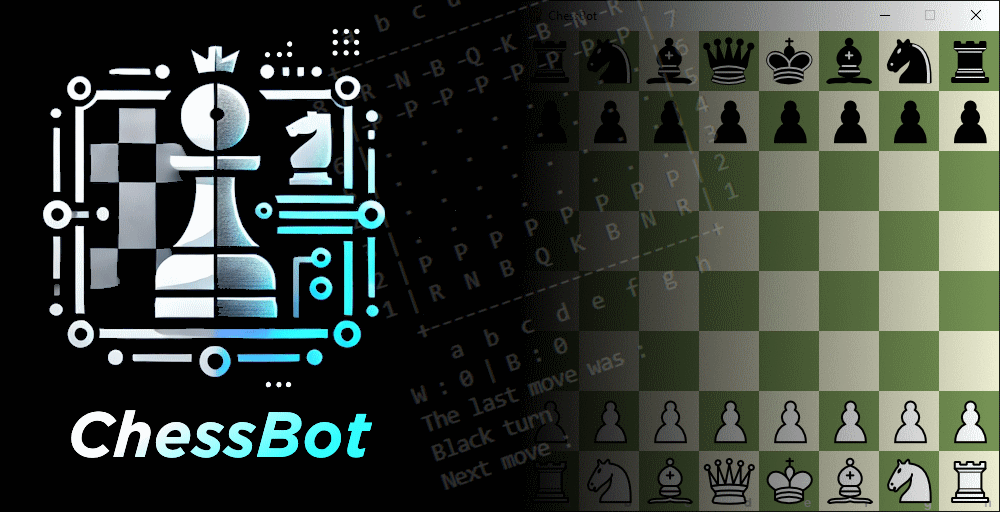

# ChessBot



>[!CAUTION]
>**Disclaimer:** This software is currently in the development phase and is intended for developers. It is not yet suitable for general use and may contain bugs.

> [!WARNING]
> The only documentation is this read me! Please note that more documentation will be provided in the future.

## About

ChessBot is a chess game with a graphical interface and terminal-based interaction. Its ultimate goal is to implement a **Reinforcement Learning (RL)**-powered AI capable of playing chess against a human or another AI. Currently, the project includes a functional chessboard interface, basic game mechanics, and a framework for AI integration.


## Features

### Current Features
- **Graphical Interface:** A chessboard displayed using [`pygame`](https://www.pygame.org/) that renders pieces and board positions.

- **Terminal Interface:** A text-based chessboard and command system for simpler interaction.

- **Move Validation:** Validation of piece movements according to chess rules, including:
  - Standard moves for all pieces (pawns, knights, bishops, rooks, queens, and kings).
  - Special moves such as *castling*, *pawn promotion*, and *en passant*.

- **Basic Scoring System:** Tracks scores based on piece values.

- **Interactive Gameplay:** Players can input moves via the terminal or graphical interface.

### Future Features

- **Reinforcement Learning AI:** Train an AI model to learn and play chess strategically.

- **AI vs. AI Mode:** Enable ChessBot to simulate games between two AI agents.

- **Save/Load Games:** Add functionality to save and resume games.

- **Multiplayer Mode:** Allow two players to compete on the same interface or online.


## Installation

### Requirements
- [Python 3.8+](https://www.python.org/)
- Dependencies:
  - [`pygame`](https://www.pygame.org/)

### Setup

1. Clone the repository:
   ```bash
   git clone https://github.com/RonanLc/ChessBot.git
   cd ChessBot
   ```

2. Clone the repository:
   ```bash
   pip install pygame
   ```

3. Clone the repository:
    ```bash
    python main.py
    ```

## File Structure

- [`main.py`](https://github.com/RonanLc/ChessBot/blob/main/Chess_Game/main.py) : The entry point of the project. Handles game initialization, user interaction, and game flow.

- [`UI.py`](https://github.com/RonanLc/ChessBot/blob/main/Chess_Game/UI.py) : Contains the graphical interface for rendering the chessboard and pieces using pygame.

- [`move.py`](https://github.com/RonanLc/ChessBot/blob/main/Chess_Game/move.py) : Implements movement logic and validation for all chess pieces. Includes special moves like castling and pawn promotion.

- [`piece_move.py`](https://github.com/RonanLc/ChessBot/blob/main/Chess_Game/piece_move.py) : Contains detailed movement rules for each piece (e.g., pawn, rook, knight). Uses helper tools for board position calculations.

## How It Works

### Gameplay

- The chessboard can be viewed either graphically or in the terminal.

    Set [`UI_interface`](https://github.com/RonanLc/ChessBot/blob/main/Chess_Game/main.py) to `False` to desactivate the pygame interface. (NB: this will display the chessboard in the terminal)

    Set [`UI_terminal`](https://github.com/RonanLc/ChessBot/blob/main/Chess_Game/main.py) to `False` to desactivate the terminal interface.

- Moves are input in [standard chess notation](https://en.wikipedia.org/wiki/Algebraic_notation_(chess)), e.g., `e2e4` (pawn moves from e2 to e4) or `Nb1c3` (knight moves from b1 to c3).

    Standard chess pieces are used as follows: `K` - King | `Q` - Queen | `B` - Bishop | `N` - Knight | `R` - Rook | `P` - Pawn

- The system validates each move and applies it to the board.

### Code Highlights

1. **Graphical Interface :**

    The UI.py module uses pygame to draw the board and render pieces dynamically.

2. **Move Validation:**
    
    The move.py module uses dictionaries like pieces_trad and pieces_trad_inv to map piece symbols to values and vice versa, ensuring correctness.

3. **Piece Logic:**
    
    piece_move.py manages individual piece rules, including special movements.

4. **Terminal Interface:**
    
    The terminal-based chessboard in main.py provides an alternative to the graphical interface.

## Planned AI Development
    
The ultimate goal is to implement an RL-based AI for ChessBot. Here's the roadmap:

1. **Environment Setup:** ❌

    - Use the current chess logic as the foundation for the RL environment. ❌
    - Define states, actions, and rewards based on chess positions. ❌

2. **Model Training:** ❌

    - Train the AI using reinforcement learning techniques such as Q-learning or Deep Q-Networks (DQN). ❌
    - Focus on strategic learning through simulated self-play. ❌

3. **Integration:** ❌

    - Allow the AI to compete against human players or another AI in real-time.

## Contributing

Contributions are welcome! Please feel free to submit issues or pull requests for bug fixes, feature enhancements, or documentation improvements.

## License

This project is currently unlicensed.

## Acknowledgments

- Thanks to the developers of pygame for the easy-to-use 2D graphics library.
- Thanks to Wikipedia Commons for providing the [pieces images](https://commons.wikimedia.org/wiki/Category:PNG_chess_pieces/Standard_transparent) used.
- Inspired by the classic game of chess and the advancements in AI for board games.